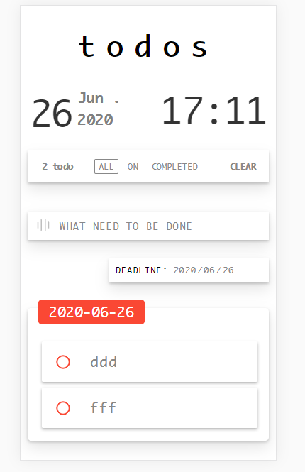

# TODOMVC

Author: 1751358 LeePaangSang

Preview：http://49.235.158.28/

Repository：https://github.com/lupus666/TODOMVC

## 功能
### 基本功能

- [x] 新增`Todo`
- [x] 删除`Todo`(拖拽删除)
- [x] 展现`Todo`列表
- [x] 全部完成/取消
- [x] 删除已完成
- [x] 保存页面状态，刷新页面后可恢复

### 高级功能/亮点

- [x] 过滤（`All`、`Ongoing`、`Completed`）

  根据完成状态来进行过滤

- [x] 编辑单条`Todo`

  点击按钮进行编辑

- [x] 添加`Todo`的`Deadline`

  在日期选择框内选择`Deadline`

- [x] 以`Deadline`分块显示`TodoList`

  同一日的`Deadline`的`todoItem`分在同一个分块中进行展示

- [x] 按照`Deadline`的剩余天数改变颜色

  根据剩余天数分别显示为红色、橙色、绿色、蓝色、灰色

- [x] 拖拽单条`Todo`换位

  拖拽单条`TodoItem`在同一天分块内进行顺序调整。

- [x] 拖拽整个`Deadline`分块换位

  拖拽整个分块在不同日期分块进行顺序调整。

- [x] 切换颜色主题（点击`logo`进行切换）

  点击`logo`进行黑色、白色颜色主题切换

## 界面

### PC

### MOBILE

